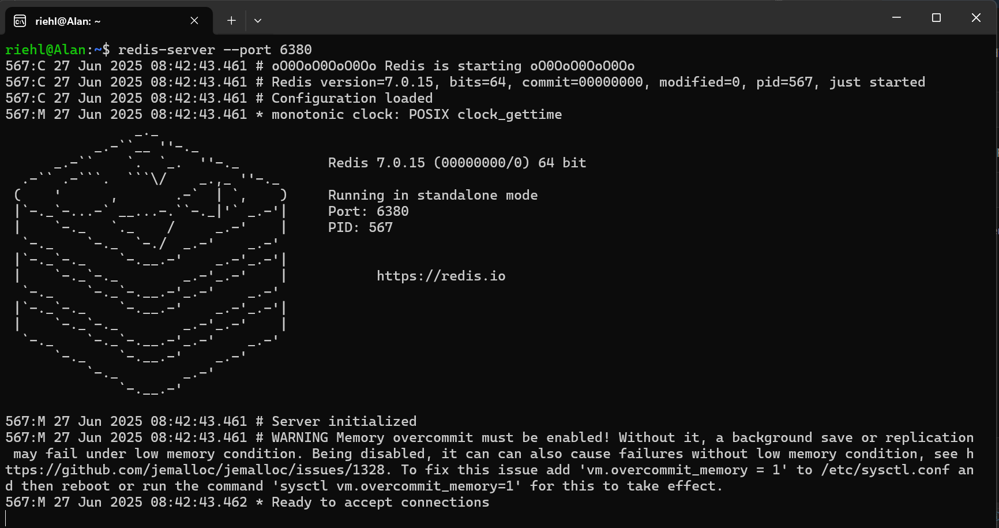
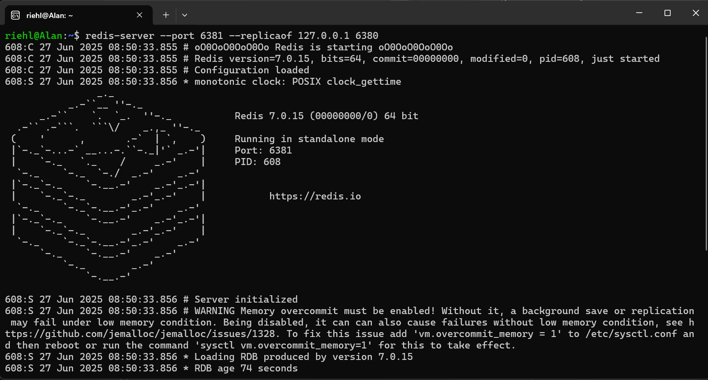
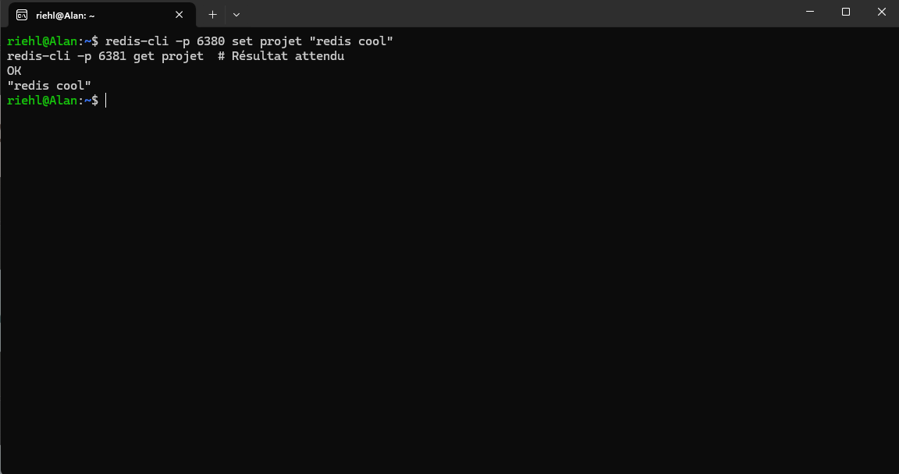
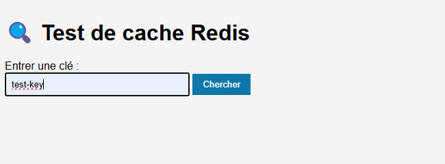
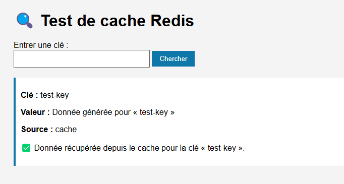
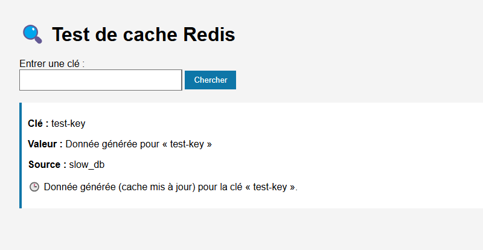
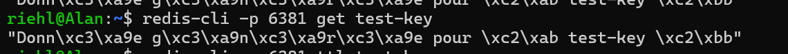
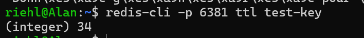
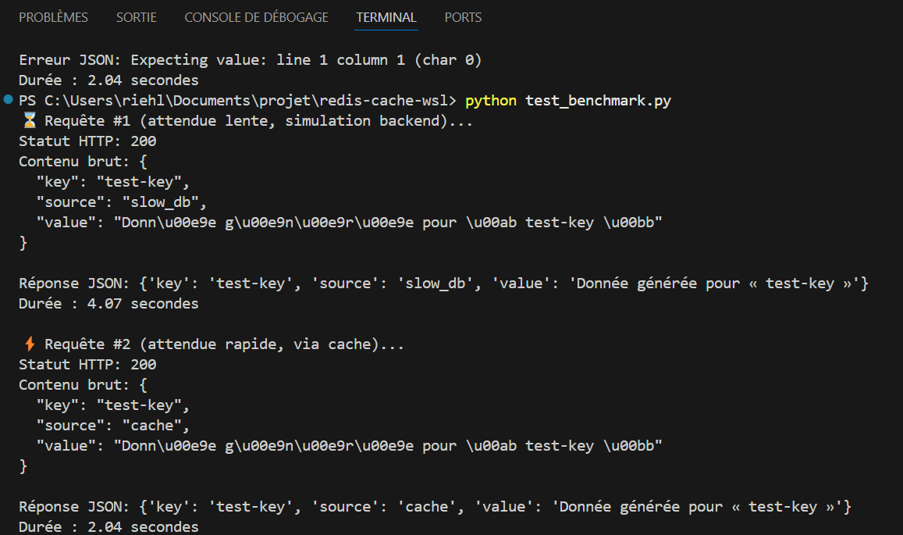

# 🧠 Atelier Redis – Projet de démonstration


Ce projet montre comment intégrer Redis dans une application web selon une architecture distribuée et utiliser Redis comme **cache côté serveur**.

---

## ✅ Objectif

- Installer et configurer Redis sous WSL  
- Mettre en place une **réplication Master/Slave**  
- Intégrer Redis dans une application Flask comme **cache-aside**  
- Démontrer les **bénéfices en performance** et la **gestion du TTL**

---

## 🗂️ Arborescence du projet

redis-cache-wsl/  
│  
├── app.py # Application Flask  
├── test_benchmark.py # Script de test de performances (console)  
├── demo_script.sh # Script console JSON avec curl  
├── demo_script_html.sh # Script test visuel dans le navigateur  
├── requirements.txt # Dépendances Python  
│  
├── master.conf # Configuration du Redis master (port 6380)  
├── slave.conf # Configuration du Redis slave (port 6381)  
│  
├── templates/  
│   └── index.html # Interface utilisateur HTML (formulaire)  
│  
└── README.md # Ce fichier

---

## 🧰 Partie 1 – Installation de Redis

- Redis installé via WSL :  
  ```bash
  sudo apt update && sudo apt install redis
  ```  
  Vérification :
  ```bash
  redis-server --version
  ```

---

## 🌐 Partie 2 – Réplication Master / Slave


Deux instances Redis :

**Master sur port 6380 :**
```bash
redis-server ./master.conf
```


**Slave sur port 6381 :**
```bash
redis-server ./slave.conf
```

🔁 Test de réplication :
```bash
redis-cli -p 6380 set projet "redis cool"
redis-cli -p 6381 get projet  # Résultat attendu : redis cool
```

---

## 💻 Partie 3 – Application web avec cache Redis


📦 Lancement :
```bash
python app.py
```
🧠 Stratégie :
1. Cherche la clé dans Redis  
2. Si absente → simule lenteur (2 sec), stocke dans Redis 60 s  
3. Si présente → réponse instantanée (cache)

🔎 Interface web :  
http://localhost:5000  
Formulaire avec retour visuel (clé, valeur, source, état du cache)

---

## 🔬 Partie 4 – Démonstration & validation


✅ Étapes du test visuel :
1. Entrer une clé (ex : `test-key`) 
 
2. Résultat lent ➝ *slow_db*  

3. Refaire la requête ➝ *cache*, réponse immédiate  

4. Attendre 60 s ➝ cache expire  
5. Requête ➝ retour à *slow_db*, re-cache


🔧 Validation CLI :
```bash
redis-cli -p 6380 get test-key
```
Affiche la valeur de la clé `test-key` sur l’instance Redis du port 6380 (master).

```bash
redis-cli -p 6381 get test-key
```
Affiche la valeur de la même clé sur l’instance Redis du port 6381 (slave).  
Permet de vérifier que la réplication fonctionne correctement.


```bash
redis-cli -p 6380 ttl test-key
```
Affiche le temps restant avant expiration (TTL) de la clé `test-key` sur le master.




📦 Fichiers de test  
- `test_benchmark.py` ➝ test console (affiche durées)  


---

## ✅ Résultat attendu

✔️ Cache côté serveur fonctionnel  
⚡ Temps de réponse optimisé  
⏱️ Données expirables (TTL)  
🔁 Réplication Master → Slave opérationnelle  
🧑‍💻 Interface simple et claire pour tester

---

## 🧾 Bilan – Pourquoi Redis est utile dans une application web

Redis apporte des avantages clés dans le développement d'applications modernes :

- ⚡ **Performance** : les données mises en cache sont servies en quelques millisecondes, réduisant fortement le temps de réponse et la charge sur les bases de données lentes.  
- 🔁 **Réplication** : Redis permet de répliquer les données sur plusieurs nœuds (Master/Slave ou Cluster), augmentant la tolérance aux pannes et la scalabilité.  
- ⏳ **Expiration automatique** : les données peuvent être temporairement stockées (grâce au TTL), évitant une accumulation inutile de mémoire.  
- 🧠 **Simplicité** : son modèle clé/valeur et ses structures de données riches (listes, ensembles, etc.) en font un outil facile à prendre en main mais puissant.  
- 📦 **Cache-aside** : Redis est idéal pour le modèle où l'application contrôle explicitement ce qui est mis ou lu du cache, comme démontré ici.

🎯 **En résumé** : Redis est un outil essentiel pour optimiser les performances, gérer les ressources intelligemment, et préparer une application à une montée en charge efficace.


